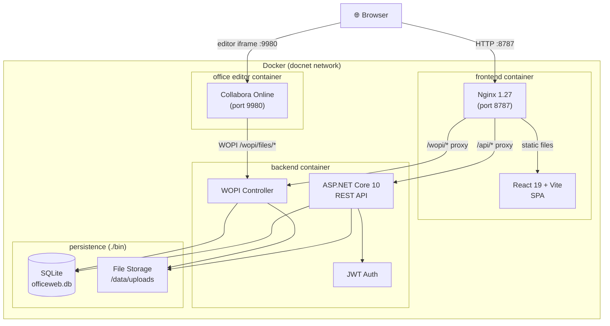

# OfficeWeb — Document Manager

A self-hosted document management system with in-browser office editing via the WOPI protocol. Supports [Collabora Online](https://www.collaboraonline.com/) and [OnlyOffice](https://www.onlyoffice.com/) as interchangeable editor backends.

---

## Architecture



### Request Flow

```
Browser
  │
  ├─ Static assets (HTML/JS/CSS)
  │    └─► Nginx ──► React SPA (served from container)
  │
  ├─ REST API calls  /api/**
  │    └─► Nginx ──► ASP.NET Core ──► SQLite / disk
  │
  ├─ WOPI protocol   /wopi/**
  │    └─► Nginx ──► WopiController ──► disk (read/write file)
  │              ↑
  │         (called by editor)
  │
  └─ Editor iframe   :9980
       └─► Collabora Online
                 │
                 └─ calls WOPI back-channel ──► backend /wopi/**
```

---

## Tech Stack

| Layer | Technology |
|---|---|
| Frontend | React 19, Vite 6, TypeScript, TailwindCSS 3, React Router 7 |
| Backend | ASP.NET Core 10, Entity Framework Core 9 (SQLite) |
| Auth | JWT Bearer (24h expiry) |
| Office Editing | WOPI protocol — Collabora Online or OnlyOffice |
| Container | Docker Compose, Nginx 1.27-alpine |

---

## Getting Started

### Docker (recommended)

```bash
# Collabora Online as editor
docker compose -f docker-compose.yml -f docker-compose.collabora.yml up -d

# OnlyOffice as editor
docker compose -f docker-compose.yml -f docker-compose.onlyoffice.yml up -d
```

Open **http://localhost:8787** in your browser.

### Local Development

**Backend**

```bash
cd backend/OfficeWeb.API
dotnet run
# API at http://localhost:5000
```

**Frontend**

```bash
cd frontend
npm install
npm run dev
# UI at http://localhost:5173
```

> Vite proxies `/api/` and `/wopi/` to the backend automatically.

---

## API Overview

| Method | Path | Description |
|---|---|---|
| `POST` | `/api/auth/register` | Create account |
| `POST` | `/api/auth/login` | Get JWT token |
| `GET` | `/api/documents` | List documents |
| `POST` | `/api/documents` | Upload document |
| `GET` | `/api/documents/{id}` | Download document |
| `DELETE` | `/api/documents/{id}` | Delete document |
| `GET` | `/api/editors/{id}` | Get editor launch URL |
| `GET` | `/wopi/files/{id}` | WOPI CheckFileInfo |
| `GET` | `/wopi/files/{id}/contents` | WOPI GetFile |
| `POST` | `/wopi/files/{id}/contents` | WOPI PutFile |

---

## Project Structure

```
doc-manager/
├── backend/OfficeWeb.API/
│   ├── Controllers/        # Auth, Documents, Editors, Wopi
│   ├── Services/           # AuthService, DocumentService, WopiTokenService
│   ├── Models/             # User, Document, WopiModels
│   ├── Data/               # AppDbContext (EF Core)
│   └── Dockerfile
├── frontend/
│   ├── src/
│   │   ├── api/            # Axios clients (auth, documents)
│   │   ├── components/     # DocumentCard, UploadModal, WopiEditor, Layout
│   │   ├── contexts/       # AuthContext
│   │   ├── pages/          # Home, Editor, Login, Register
│   │   └── types/
│   ├── nginx.conf
│   └── Dockerfile
├── docker-compose.yml
├── docker-compose.collabora.yml
└── docker-compose.onlyoffice.yml
```
